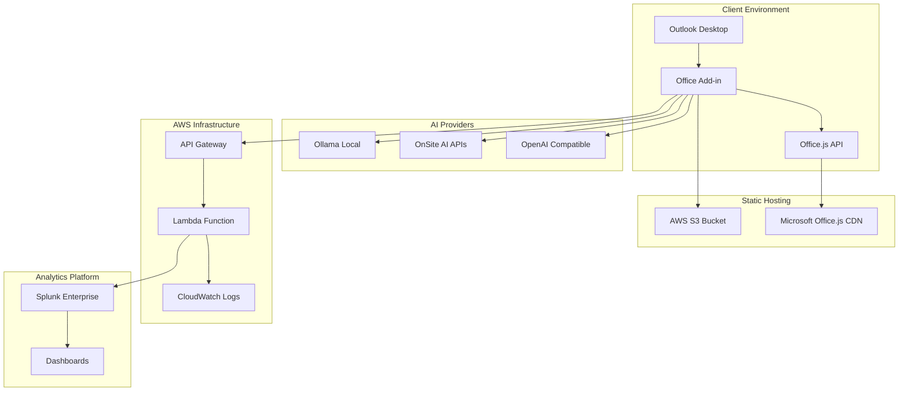
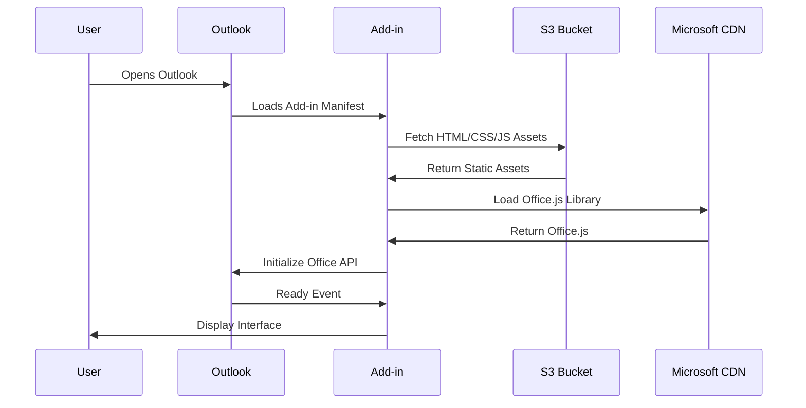
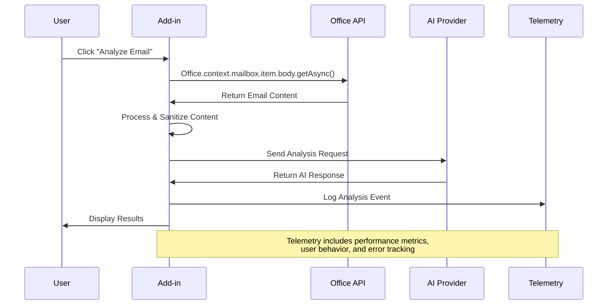
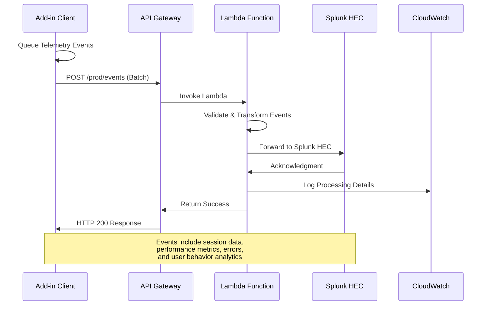
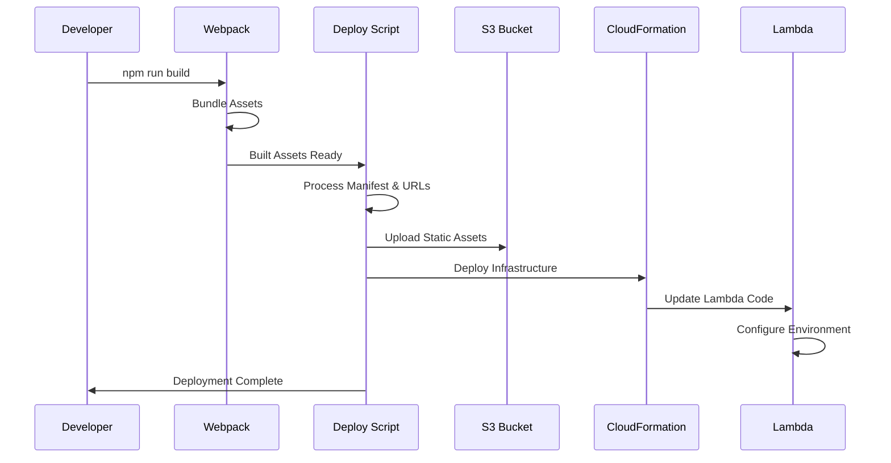
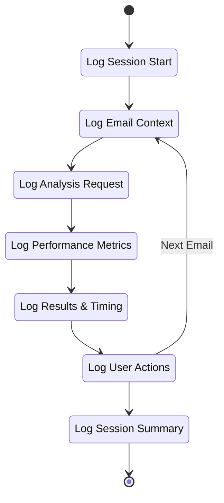
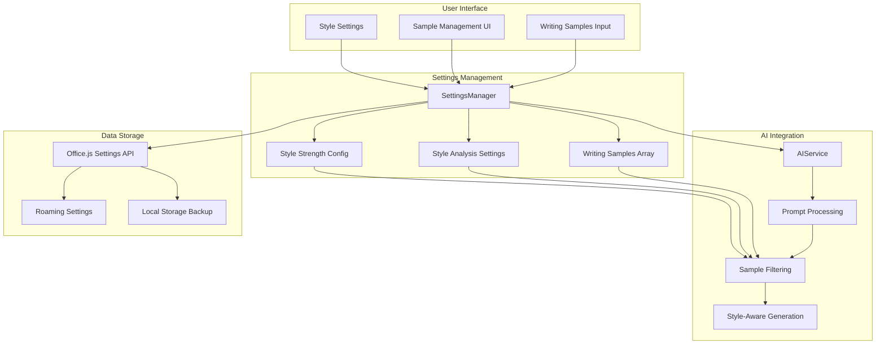

# PromptEmail Architecture Guide

## System Overview

PromptEmail is an Office Add-in that integrates AI-powered email analysis with secure telemetry collection. The system consists of multiple interconnected components spanning client-side Office.js integration, serverless AWS infrastructure, and enterprise analytics.

## High-Level Architecture

## Component Interaction Flows

### 1. Add-in Initialization Sequence

### 2. Email Analysis Workflow

### 3. Telemetry Pipeline Architecture

### 4. Deployment Pipeline Flow

## Environment & Deployment Architecture

## Technology Stack

| Layer | Technology | Purpose |
|-------|------------|---------|
| **Frontend** | Office.js, JavaScript ES6+, HTML5, CSS3 | Client-side add-in interface |
| **Build System** | Webpack 5, Babel, npm scripts | Asset bundling and build automation |
| **Static Hosting** | AWS S3, CloudFront CDN (optional)| Static asset delivery and caching |
| **Serverless API** | AWS API Gateway, Lambda (Node.js) | Telemetry collection and processing |
| **Analytics** | Splunk Enterprise, HTTP Event Collector | Data analysis and visualization |
| **Infrastructure** | AWS CloudFormation, PowerShell scripts | Infrastructure as Code |
| **AI Integration** | OpenAI API, Ollama, Custom APIs | AI-powered email analysis and style personalization |
| **Settings Storage** | Office.js RoamingSettings + localStorage | Dual-layer user preferences and writing samples persistence |
| **Monitoring** | AWS CloudWatch, Splunk dashboards | System monitoring and alerting |

## Data Flow Patterns

### Event-Driven Telemetry

### Writing Samples & Style Personalization

The system includes a sophisticated writing samples feature that allows users to train the AI on their personal writing style for more authentic email responses.

#### Writing Samples Data Flow

1. **Sample Collection**: Users input examples of their written communication
2. **Storage**: Samples stored with metadata (date, word count, unique ID) using Office.js Settings API
3. **Style Analysis**: System analyzes writing patterns when style-analysis is enabled
4. **Prompt Enhancement**: AI prompts include selected samples based on style strength settings
5. **Contextual Generation**: AI generates responses that match user's writing style and tone

#### Style Strength Configuration

| Setting | Sample Count | Use Case |
|---------|-------------|-----------|
| **Light** | 2 samples | Subtle style influence |
| **Medium** | 3 samples | Balanced personalization |
| **Strong** | 5 samples | Maximum style matching |

### Security & Privacy Considerations

**Data Protection:**
- Writing samples stored using dual-layer approach: Office.js RoamingSettings (primary) with localStorage fallback
- Cross-device roaming when Office.js RoamingSettings available, local-only when using localStorage fallback
- No external transmission of samples except to user-configured AI providers
- Automatic encryption through Office 365 when using RoamingSettings, browser security when using localStorage
- User control over sample retention and deletion

**Token Management:**
- Intelligent sample selection to optimize context window usage
- Monitoring and logging of token consumption for transparency
- Fallback mechanisms when samples approach token limits
- Debug logging for token usage analysis

---

## Additional Resources

- [Developer Guide](docs/DEVELOPER_GUIDE.md) - Development setup and workflows
- [Deployment Guide](tools/README.md) - Infrastructure deployment
