# PromptEmail Architecture Guide

## System Overview

PromptEmail is an Office Add-in that integrates AI-powered email analysis with secure telemetry collection. The system consists of multiple interconnected components spanning client-side Office.js integration, serverless AWS infrastructure, and enterprise analytics.

## High-Level Architecture

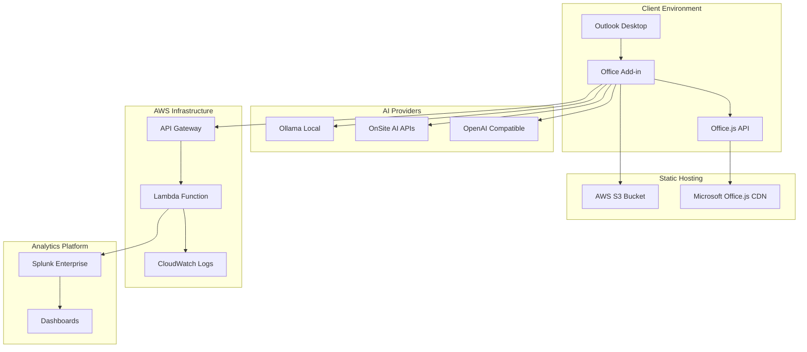
```mermaid
graph TB
    subgraph "Client Environment"
        OL[Outlook Desktop]
        OA[Office Add-in]
        OJS[Office.js API]
    end
    
    subgraph "Static Hosting"
        S3[AWS S3 Bucket]
        MS[Microsoft Office.js CDN]
    end
    
    subgraph "AI Providers"
        OLLAMA[Ollama Local]
        ONSITE[OnSite AI APIs]
        OPENAI[OpenAI Compatible]
    end
    
    subgraph "AWS Infrastructure"
        APIG[API Gateway]
        LAMBDA[Lambda Function]
        CW[CloudWatch Logs]
    end
    
    subgraph "Analytics Platform"
        SPLUNK[Splunk Enterprise]
        DASH[Dashboards]
    end
    
    OL --> OA
    OA --> OJS
    OA --> S3
    OJS --> MS
    
    OA --> OLLAMA
    OA --> ONSITE
    OA --> OPENAI
    
    OA --> APIG
    APIG --> LAMBDA
    LAMBDA --> SPLUNK
    LAMBDA --> CW
    
    SPLUNK --> DASH
```

## Component Interaction Flows

### 1. Add-in Initialization Sequence

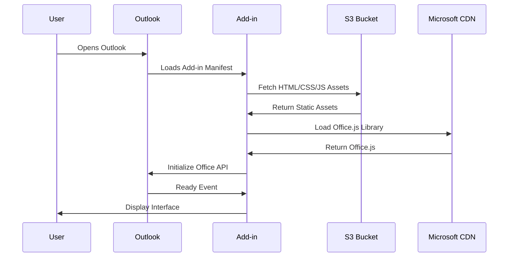
```mermaid
sequenceDiagram
    participant U as User
    participant O as Outlook
    participant A as Add-in
    participant S3 as S3 Bucket
    participant MS as Microsoft CDN
    
    U->>O: Opens Outlook
    O->>A: Loads Add-in Manifest
    A->>S3: Fetch HTML/CSS/JS Assets
    S3->>A: Return Static Assets
    A->>MS: Load Office.js Library
    MS->>A: Return Office.js
    A->>O: Initialize Office API
    O->>A: Ready Event
    A->>U: Display Interface
```

### 2. Email Analysis Workflow

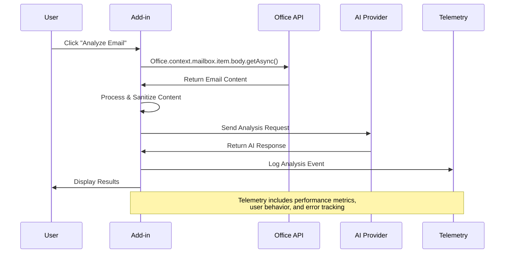
```mermaid
sequenceDiagram
    participant U as User
    participant A as Add-in
    participant O as Office API
    participant AI as AI Provider
    participant T as Telemetry
    
    U->>A: Click "Analyze Email"
    A->>O: Office.context.mailbox.item.body.getAsync()
    O->>A: Return Email Content
    A->>A: Process & Sanitize Content
    A->>AI: Send Analysis Request
    AI->>A: Return AI Response
    A->>T: Log Analysis Event
    A->>U: Display Results
    
    Note over A,T: Telemetry includes performance metrics,<br/>user behavior, and error tracking
```

### 3. Telemetry Pipeline Architecture

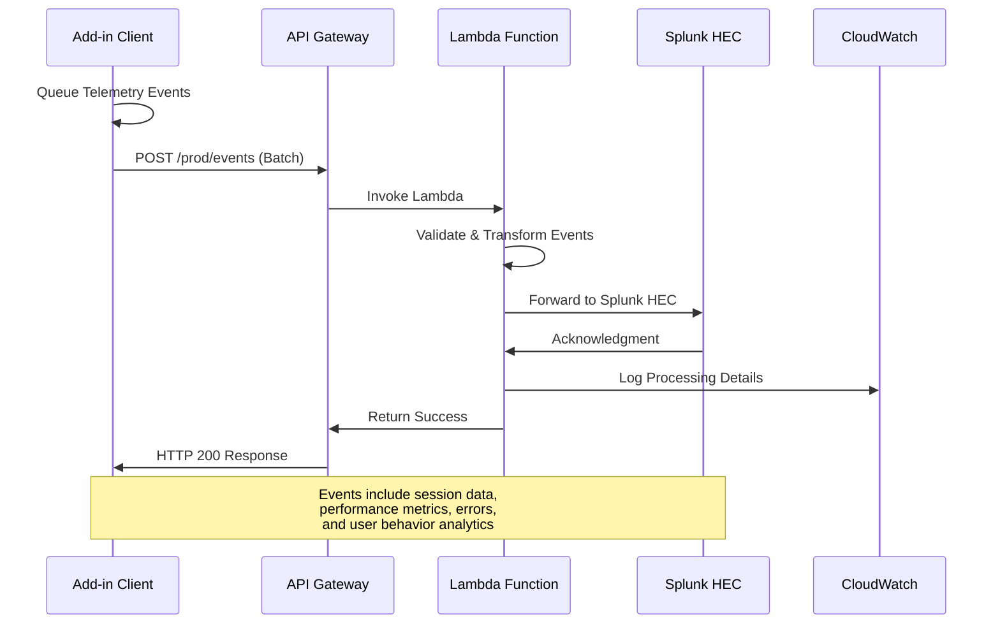
```mermaid
sequenceDiagram
    participant A as Add-in Client
    participant AG as API Gateway
    participant L as Lambda Function
    participant S as Splunk HEC
    participant CW as CloudWatch
    
    A->>A: Queue Telemetry Events
    A->>AG: POST /prod/events (Batch)
    AG->>L: Invoke Lambda
    L->>L: Validate & Transform Events
    L->>S: Forward to Splunk HEC
    S->>L: Acknowledgment
    L->>CW: Log Processing Details
    L->>AG: Return Success
    AG->>A: HTTP 200 Response
    
    Note over A,S: Events include session data,<br/>performance metrics, errors,<br/>and user behavior analytics
```

### 4. Deployment Pipeline Flow

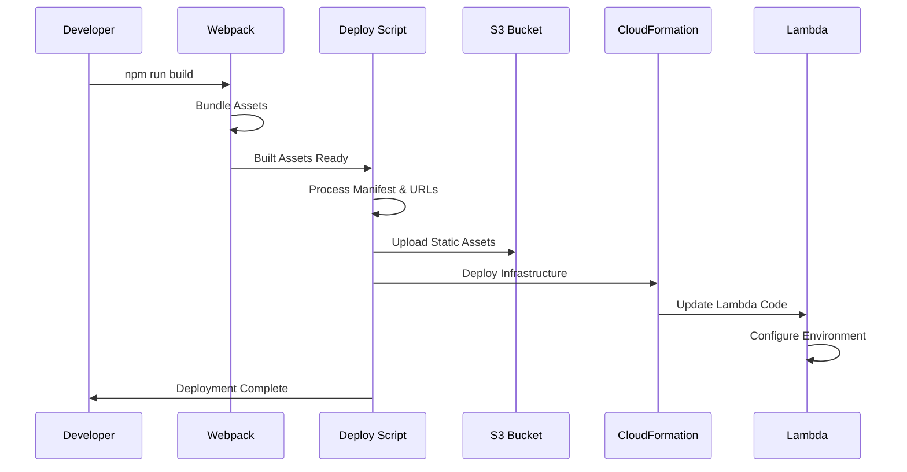
```mermaid
sequenceDiagram
    participant D as Developer
    participant W as Webpack
    participant S as Deploy Script
    participant S3 as S3 Bucket
    participant CF as CloudFormation
    participant L as Lambda
    
    D->>W: npm run build
    W->>W: Bundle Assets
    W->>S: Built Assets Ready
    S->>S: Process Manifest & URLs
    S->>S3: Upload Static Assets
    S->>CF: Deploy Infrastructure
    CF->>L: Update Lambda Code
    L->>L: Configure Environment
    S->>D: Deployment Complete
```

## Component Architecture

### Frontend Architecture

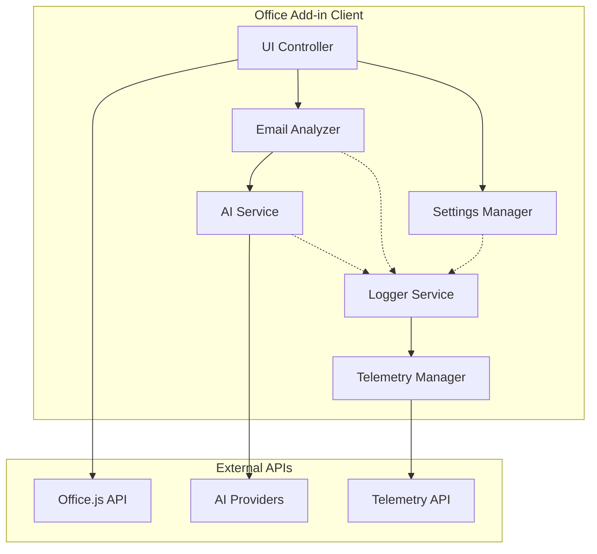
```mermaid
graph TB
    subgraph "Office Add-in Client"
        UI[UI Controller]
        SM[Settings Manager]
        EM[Email Analyzer]
        AS[AI Service]
        LOG[Logger Service]
        TM[Telemetry Manager]
    end
    
    subgraph "External APIs"
        OJS[Office.js API]
        AI[AI Providers]
        TEL[Telemetry API]
    end
    
    UI --> SM
    UI --> EM
    EM --> AS
    AS --> AI
    LOG --> TM
    TM --> TEL
    UI --> OJS
    
    SM -.-> LOG
    EM -.-> LOG
    AS -.-> LOG
```

### Backend Infrastructure

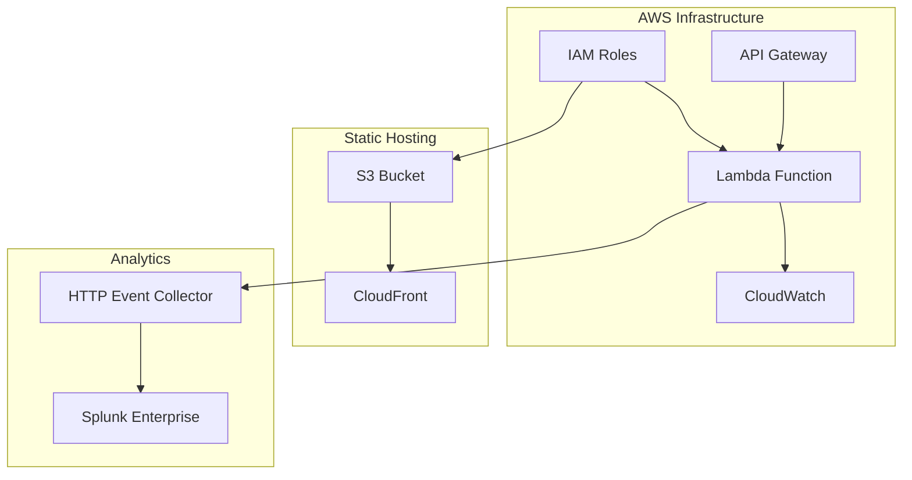
```mermaid
graph TB
    subgraph "AWS Infrastructure"
        AG[API Gateway]
        LAM[Lambda Function]
        CW[CloudWatch]
        IAM[IAM Roles]
    end
    
    subgraph "Static Hosting"
        S3[S3 Bucket]
        CF[CloudFront]
    end
    
    subgraph "Analytics"
        SPLUNK[Splunk Enterprise]
        HEC[HTTP Event Collector]
    end
    
    AG --> LAM
    LAM --> CW
    LAM --> HEC
    HEC --> SPLUNK
    
    S3 --> CF
    
    IAM --> LAM
    IAM --> S3
```

## Security Architecture

### Authentication & Authorization Flow

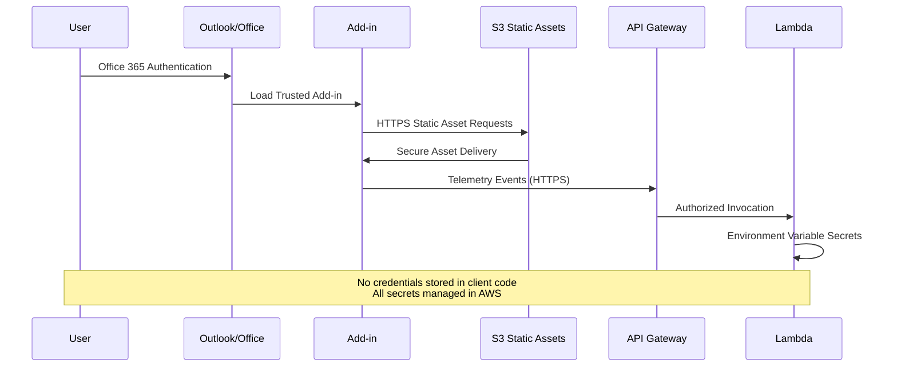
```mermaid
sequenceDiagram
    participant U as User
    participant O as Outlook/Office
    participant A as Add-in
    participant S3 as S3 Static Assets
    participant API as API Gateway
    participant L as Lambda
    
    U->>O: Office 365 Authentication
    O->>A: Load Trusted Add-in
    A->>S3: HTTPS Static Asset Requests
    S3->>A: Secure Asset Delivery
    A->>API: Telemetry Events (HTTPS)
    API->>L: Authorized Invocation
    L->>L: Environment Variable Secrets
    
    Note over U,L: No credentials stored in client code<br/>All secrets managed in AWS
```

### Data Protection Layers

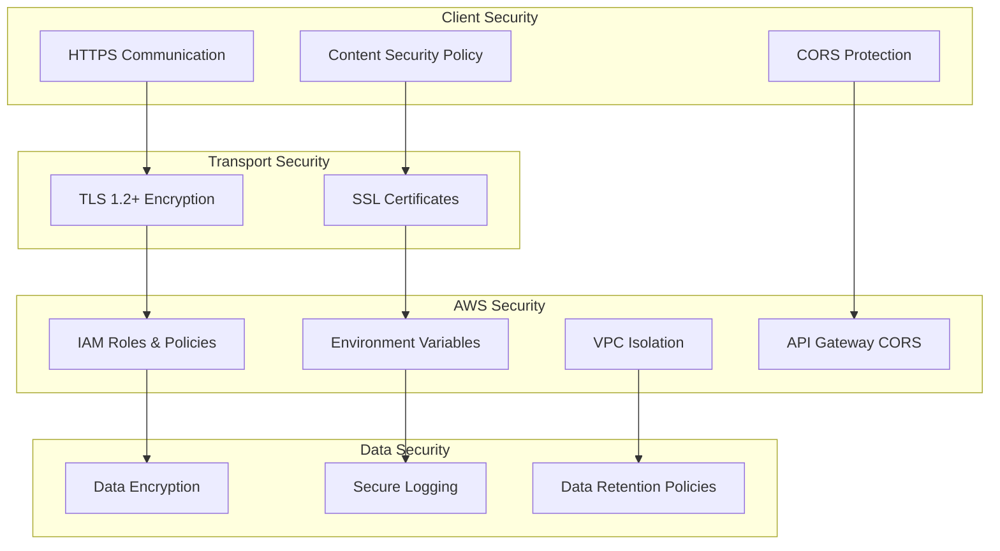
```mermaid
graph TB
    subgraph "Client Security"
        HTTPS1[HTTPS Communication]
        CSP[Content Security Policy]
        CORS1[CORS Protection]
    end
    
    subgraph "Transport Security"
        TLS[TLS 1.2+ Encryption]
        CERT[SSL Certificates]
    end
    
    subgraph "AWS Security"
        IAM[IAM Roles & Policies]
        ENV[Environment Variables]
        VPC[VPC Isolation]
        CORS2[API Gateway CORS]
    end
    
    subgraph "Data Security"
        ENC[Data Encryption]
        LOG[Secure Logging]
        RET[Data Retention Policies]
    end
    
    HTTPS1 --> TLS
    CSP --> CERT
    CORS1 --> CORS2
    
    TLS --> IAM
    CERT --> ENV
    
    IAM --> ENC
    ENV --> LOG
    VPC --> RET
```

## Environment & Deployment Architecture

### Multi-Environment Strategy

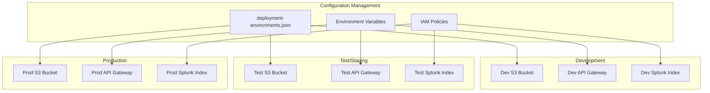
```mermaid
graph TB
    subgraph "Development"
        DEV_S3[Dev S3 Bucket]
        DEV_API[Dev API Gateway]
        DEV_SPLUNK[Dev Splunk Index]
    end
    
    subgraph "Test/Staging"
        TEST_S3[Test S3 Bucket]
        TEST_API[Test API Gateway]
        TEST_SPLUNK[Test Splunk Index]
    end
    
    subgraph "Production"
        PROD_S3[Prod S3 Bucket]
        PROD_API[Prod API Gateway]
        PROD_SPLUNK[Prod Splunk Index]
    end
    
    subgraph "Configuration Management"
        JSON[deployment-environments.json]
        ENV[Environment Variables]
        IAM[IAM Policies]
    end
    
    JSON --> DEV_S3
    JSON --> TEST_S3
    JSON --> PROD_S3
    
    ENV --> DEV_API
    ENV --> TEST_API
    ENV --> PROD_API
    
    IAM --> DEV_SPLUNK
    IAM --> TEST_SPLUNK
    IAM --> PROD_SPLUNK
```


## Technology Stack

| Layer | Technology | Purpose |
|-------|------------|---------|
| **Frontend** | Office.js, JavaScript ES6+, HTML5, CSS3 | Client-side add-in interface |
| **Build System** | Webpack 5, Babel, npm scripts | Asset bundling and build automation |
| **Static Hosting** | AWS S3, CloudFront CDN | Static asset delivery and caching |
| **Serverless API** | AWS API Gateway, Lambda (Node.js) | Telemetry collection and processing |
| **Analytics** | Splunk Enterprise, HTTP Event Collector | Data analysis and visualization |
| **Infrastructure** | AWS CloudFormation, PowerShell scripts | Infrastructure as Code |
| **AI Integration** | OpenAI API, Ollama, Custom APIs | AI-powered email analysis and style personalization |
| **Settings Storage** | Office.js RoamingSettings + localStorage | Dual-layer user preferences and writing samples persistence |
| **Monitoring** | AWS CloudWatch, Splunk dashboards | System monitoring and alerting |

## Data Flow Patterns

### Event-Driven Telemetry

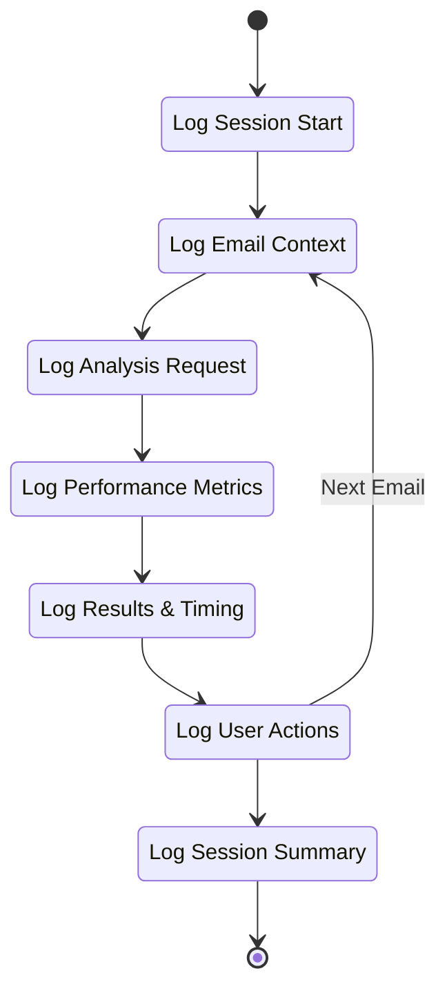
```mermaid
stateDiagram-v2
    [*] --> SessionStart
    SessionStart --> EmailSelected
    EmailSelected --> AnalysisRequested
    AnalysisRequested --> AIProcessing
    AIProcessing --> ResultsDisplayed
    ResultsDisplayed --> UserInteraction
    UserInteraction --> EmailSelected : Next Email
    UserInteraction --> SessionEnd
    SessionEnd --> [*]
    
    SessionStart : Log Session Start
    EmailSelected : Log Email Context
    AnalysisRequested : Log Analysis Request
    AIProcessing : Log Performance Metrics
    ResultsDisplayed : Log Results & Timing
    UserInteraction : Log User Actions
    SessionEnd : Log Session Summary
```

### Writing Samples & Style Personalization

The system includes a sophisticated writing samples feature that allows users to train the AI on their personal writing style for more authentic email responses.

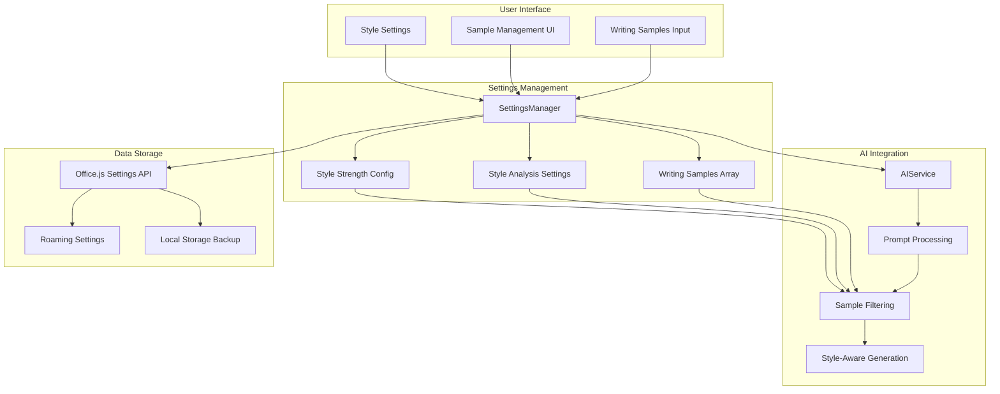
```mermaid
graph TB
    subgraph "User Interface"
        WSI[Writing Samples Input]
        WSM[Sample Management UI]
        SS[Style Settings]
    end
    
    subgraph "Settings Management"
        SM[SettingsManager]
        WS[Writing Samples Array]
        SA[Style Analysis Settings]
        ST[Style Strength Config]
    end
    
    subgraph "AI Integration"
        AI[AIService]
        PP[Prompt Processing]
        SF[Sample Filtering]
        SG[Style-Aware Generation]
    end
    
    subgraph "Data Storage"
        OS[Office.js Settings API]
        RS[Roaming Settings]
        LS[Local Storage Backup]
    end
    
    WSI --> SM
    WSM --> SM
    SS --> SM
    
    SM --> WS
    SM --> SA
    SM --> ST
    
    SM --> OS
    OS --> RS
    OS --> LS
    
    SM --> AI
    AI --> PP
    PP --> SF
    SF --> SG
    
    WS --> SF
    SA --> SF
    ST --> SF
```

#### Writing Samples Data Flow

1. **Sample Collection**: Users input examples of their written communication
2. **Storage**: Samples stored with metadata (date, word count, unique ID) using Office.js Settings API
3. **Style Analysis**: System analyzes writing patterns when style-analysis is enabled
4. **Prompt Enhancement**: AI prompts include selected samples based on style strength settings
5. **Contextual Generation**: AI generates responses that match user's writing style and tone

#### Style Strength Configuration

| Setting | Sample Count | Use Case |
|---------|-------------|-----------|
| **Light** | 2 samples | Subtle style influence |
| **Medium** | 3 samples | Balanced personalization |
| **Strong** | 5 samples | Maximum style matching |

### Telemetry Data Structure

All telemetry events automatically include comprehensive diagnostic information in a flattened structure for optimal Splunk querying:

**Office Diagnostic Fields:**
- `office_host`: The Office application (e.g., "Outlook", "Word", "Excel")
- `office_platform`: The operating system/platform ("Windows", "Mac", "Web", "iOS", "Android")
- `office_version`: The Office version number (e.g., "16.0.14332.20130")
- `office_owa_view`: For Outlook Web Access, the current view mode (optional)

**User Profile Fields:**
- `userProfile_displayName`: User's display name
- `userProfile_emailAddress`: User's email address
- `userProfile_timeZone`: User's time zone
- `userProfile_accountType`: Type of email account (e.g., "exchange", "gmail")

**Environment Fields:**
- `environment_type`: Detected environment (Dev, Test, Prod, Local, unknown)
- `environment_host`: The hostname/domain where the add-in is running

**Client Context Fields:**
- `client_browser_name`: Browser name (Chrome, Firefox, Safari, Edge, etc.)
- `client_browser_version`: Browser version number
- `client_platform`: Operating system platform (Win32, MacIntel, Linux, etc.)
- `client_language`: Primary browser language (e.g., "en-US")
- `client_timezone`: Client timezone (e.g., "America/New_York")
- `client_screen_resolution`: Screen resolution (e.g., "1920x1080")
- `client_viewport_size`: Browser viewport size (e.g., "1024x768")
- `client_connection_type`: Network connection type ("4g", "wifi", etc.)
- `client_cpu_cores`: Number of CPU cores available
- `client_device_memory_gb`: Device memory in gigabytes (if available)
- `client_js_heap_size_mb`: JavaScript heap usage in megabytes
- `client_connection_rtt_ms`: Network round-trip time in milliseconds
- `client_connection_downlink_mbps`: Download speed in Mbps

**Performance Metrics:**
- `analysis_duration_ms`: Time taken for email analysis in milliseconds
- `response_generation_duration_ms`: Time taken for response generation in milliseconds
- `total_duration_ms`: Total time for combined operations in milliseconds

**Server-side Enrichment (added by API Gateway Lambda):**
- `client_ip_address`: Client IP address (captured server-side for security)
- `request_id`: API Gateway request ID for tracing
- `api_gateway_stage`: Deployment stage (prod, dev, test)
- `server_received_time`: Server timestamp when request was received
- `server_user_agent`: Server-side captured user agent (for verification)
- `lambda_function_name`: AWS Lambda function processing the request
- `lambda_function_version`: Lambda function version

#### Example Telemetry Event Structure

```json
{
  "eventType": "email_analyzed",
  "timestamp": "2025-08-28T04:35:18.571Z",
  "source": "promptemail",
  "version": "1.2.3",
  "sessionId": "sess_1756355693822_ip835fpqb",
  
  // Office diagnostic fields (flattened)
  "office_host": "Outlook",
  "office_platform": "Windows", 
  "office_version": "16.0.14332.20130",
  "office_owa_view": "ReadingPane",
  
  // User profile fields (flattened)
  "userProfile_displayName": "John Doe",
  "userProfile_emailAddress": "john.doe@company.com",
  "userProfile_timeZone": "Pacific Standard Time",
  "userProfile_accountType": "exchange",
  
  // Environment fields (flattened)
  "environment_type": "Prod",
  "environment_host": "293354421824-outlook-email-assistant-prod.s3.us-east-1.amazonaws.com",
  
  // Client context fields (flattened)
  "client_browser_name": "Chrome",
  "client_browser_version": "116.0",
  "client_platform": "Win32",
  "client_language": "en-US",
  "client_timezone": "America/New_York",
  "client_screen_resolution": "1920x1080",
  "client_viewport_size": "1024x768",
  "client_connection_type": "4g",
  "client_cpu_cores": 8,
  "client_device_memory_gb": 16,
  "client_js_heap_size_mb": 45,
  "client_connection_rtt_ms": 50,
  "client_connection_downlink_mbps": 25.5,
  
  // Performance metrics (flattened)
  "analysis_duration_ms": 2400,
  
  // Server-side enrichment (added by API Gateway Lambda)
  "client_ip_address": "203.0.113.42",
  "request_id": "c6af9ac6-7b61-11e6-9a41-93e8deadbeef",
  "api_gateway_stage": "prod",
  "server_received_time": 1724798215571,
  "server_user_agent": "Mozilla/5.0 (Windows NT 10.0; Win64; x64)...",
  "lambda_function_name": "outlook-telemetry-proxy",
  "lambda_function_version": "12",
  
  // Original event data
  "model_service": "ollama",
  "model_name": "llama3:latest",
  "email_length": 1260,
  "recipients_count": 1,
  "analysis_success": true,
  "refinement_count": 0,
  "clipboard_used": false
}
```

#### Telemetry Benefits

1. **Enhanced Debugging**: Platform-specific issue identification and better context for reproducing problems
2. **Improved Analytics**: Flattened structure enables faster Splunk queries and better performance
3. **Support & Troubleshooting**: Immediate environmental context for customer support
4. **Feature Planning**: Environment distribution analysis for informed development decisions
5. **Privacy & Compliance**: Technical metadata collection following existing privacy practices

The telemetry system is implemented in `src/services/Logger.js` with automatic flattening and graceful fallback when Office context is unavailable.


## Monitoring & Observability

### System Health Monitoring

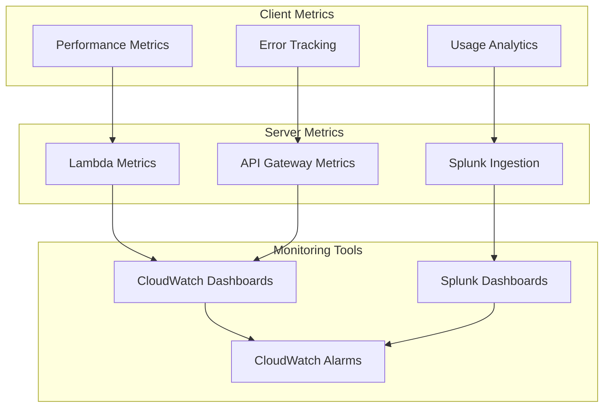
```mermaid
graph TB
    subgraph "Client Metrics"
        PERF[Performance Metrics]
        ERROR[Error Tracking]
        USAGE[Usage Analytics]
    end
    
    subgraph "Server Metrics"
        LAMBDA_METRICS[Lambda Metrics]
        API_METRICS[API Gateway Metrics]
        SPLUNK_METRICS[Splunk Ingestion]
    end
    
    subgraph "Monitoring Tools"
        CW_DASH[CloudWatch Dashboards]
        SPLUNK_DASH[Splunk Dashboards]
        ALERTS[CloudWatch Alarms]
    end
    
    PERF --> LAMBDA_METRICS
    ERROR --> API_METRICS
    USAGE --> SPLUNK_METRICS
    
    LAMBDA_METRICS --> CW_DASH
    API_METRICS --> CW_DASH
    SPLUNK_METRICS --> SPLUNK_DASH
    
    CW_DASH --> ALERTS
    SPLUNK_DASH --> ALERTS
```

## Enhanced Core Services

### SettingsManager Enhancements

The `SettingsManager` service has been enhanced to support comprehensive writing samples management:

**New Capabilities:**
- **Writing Samples CRUD**: Full create, read, update, delete operations for user writing samples
- **Style Configuration**: Management of style analysis settings and strength preferences  
- **Metadata Tracking**: Automatic word counting, timestamp tracking, and unique ID generation
- **Validation**: Input validation for sample content and configuration parameters

**Key Methods:**
- `addWritingSample(content, title)`: Adds new writing sample with automatic metadata
- `getWritingSamples()`: Retrieves all stored writing samples with filtering options
- `updateWritingSample(id, updates)`: Updates existing sample content or metadata
- `deleteWritingSample(id)`: Removes sample from storage
- `getStyleSettings()`: Retrieves style analysis configuration

### AIService Integration

The `AIService` has been enhanced to incorporate user writing samples into AI prompt generation:

**Enhanced Features:**
- **Style-Aware Prompts**: Dynamically includes user writing samples in AI prompts
- **Strength-Based Filtering**: Selects appropriate number of samples based on user preferences
- **Context Optimization**: Balances sample inclusion with token limit considerations
- **Adaptive Instructions**: Provides contextual style guidance to AI models

**Integration Points:**
- `buildResponsePrompt()` method enhanced with `settingsManager` parameter
- Automatic sample filtering based on style strength configuration
- Comprehensive debug logging for sample inclusion and token usage
- Graceful degradation when samples exceed context limits

### Security & Privacy Considerations

**Data Protection:**
- Writing samples stored using dual-layer approach: Office.js RoamingSettings (primary) with localStorage fallback
- Cross-device roaming when Office.js RoamingSettings available, local-only when using localStorage fallback
- No external transmission of samples except to user-configured AI providers
- Automatic encryption through Office 365 when using RoamingSettings, browser security when using localStorage
- User control over sample retention and deletion

**Token Management:**
- Intelligent sample selection to optimize context window usage
- Monitoring and logging of token consumption for transparency
- Fallback mechanisms when samples approach token limits
- Debug logging for token usage analysis

---

## Additional Resources

- [Developer Guide](docs/DEVELOPER_GUIDE.md) - Development setup and workflows
- [Deployment Guide](tools/README.md) - Infrastructure deployment
