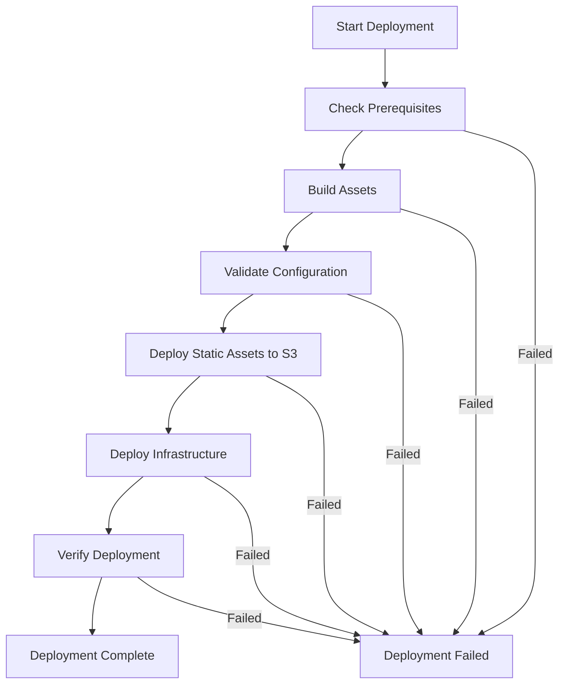

# Deployment Guide - PromptEmail Outlook Add-in

## Overview

This guide provides comprehensive deployment instructions for the PromptEmail Outlook Add-in across different environments and deployment scenarios.

## Prerequisites

### System Requirements
- **PowerShell**: 5.1+ or PowerShell Core 7+
- **AWS CLI**: Latest version, configured with appropriate credentials
- **Node.js**: 16.x or later
- **npm**: 8.x or later

## Deployment Architecture

### Environment Strategy
The system supports three deployment environments:

| Environment | Purpose | Configuration |
|-------------|---------|---------------|
| **Dev** | Development and testing | `tools/deployment-environments.json` |
| **Test** | Pre-production validation | `tools/deployment-environments.json` |
| **Prod** | Production deployment | `tools/deployment-environments.json` |

### Deployment Flow


## Configuration

### 1. Environment Configuration

Edit `tools/deployment-environments.json`:

```json
{
  "environments": {
    "Dev": {
      "region": "us-east-1",
      "publicUri": {
        "protocol": "https",
        "host": "your-dev-bucket.s3.us-east-1.amazonaws.com"
      },
      "s3Uri": {
        "protocol": "s3", 
        "host": "your-dev-bucket"
      },
      "officeJsUrl": "https://appsforoffice.microsoft.com/lib/1/hosted/office.js"
    }
  }
}
```

### 2. AI Provider Configuration

Configure AI providers in `src/config/ai-providers.json`:

```json
{
  "_config": {
    "githubRepository": "https://github.com/your-org/outlook-email-assistant",
    "telemetryUrl": "https://your-splunk.company.com:8000"
  },
  "ollama": {
    "baseUrl": "http://localhost:11434",
    "defaultModel": "llama3:latest"
  }
}
```

### 3. Telemetry Configuration 

Configure telemetry in `src/config/telemetry.json`:

```json
{
  "apiGateway": {
    "enabled": true,
    "baseUrl": "https://your-api-gateway.execute-api.us-east-1.amazonaws.com",
    "stage": "prod",
    "batchSize": 10,
    "flushInterval": 30000
  }
}
```

### 4. Writing Samples Configuration

The writing samples feature requires no additional configuration files but relies on Office.js Settings API for storage. Consider the following deployment implications:

**Storage Requirements:**
- Dual-layer storage: Office.js RoamingSettings (primary) + localStorage (fallback)
- Cross-device synchronization available when Office 365 roaming settings enabled
- Graceful degradation to browser localStorage when Office.js unavailable
- Settings size limits: Office.js supports up to 2MB per add-in, localStorage typically 5-10MB

**Feature Defaults:**
- Writing samples: Empty array (users add samples through UI)
- Style analysis: Enabled by default
- Style strength: Medium (3 samples included in prompts)

**Validation Steps:**
- Verify Office.js Settings API accessibility
- Test sample storage and retrieval functionality
- Confirm cross-device roaming behavior (if applicable)

## Deployment Procedures

### Quick Deployment

For standard deployments to an existing environment:

```powershell
# Deploy to development
.\tools\deploy_web_assets.ps1 -Environment Dev -Force

# Deploy to production
.\tools\deploy_web_assets.ps1 -Environment Prod -Force

# Deploy with version increment
.\tools\deploy_web_assets.ps1 -Environment Prod -IncrementVersion patch -Force
```

### First-Time Environment Setup

#### Step 1: Create S3 Bucket
```bash
aws s3 mb s3://your-outlook-assistant-bucket --region us-east-1
aws s3api put-bucket-policy --bucket your-outlook-assistant-bucket --policy file://s3-bucket-policy.json
```

#### Step 2: Deploy Telemetry Infrastructure
```powershell
.\aws-infrastructure\deploy-splunk-gateway.ps1 `
    -SplunkHecToken "your-hec-token" `
    -SplunkHecUrl "https://your-splunk.com:8088" `
    -Region "us-east-1" `
    -Environment "prod"
```

#### Step 3: Update Configuration
Update `tools/deployment-environments.json` with your bucket details and API Gateway endpoint.

#### Step 4: Deploy Application
```powershell
.\tools\deploy_web_assets.ps1 -Environment Prod -Force
```

### Deployment Validation

#### Automated Validation Script
```powershell
# Validate deployment
function Test-Deployment {
    param($Environment)
    
    # Check S3 accessibility
    $config = Get-Content "tools/deployment-environments.json" | ConvertFrom-Json
    $baseUrl = $config.environments.$Environment.publicUri.protocol + "://" + $config.environments.$Environment.publicUri.host
    
    try {
        $response = Invoke-WebRequest "$baseUrl/index.html" -Method Head
        if ($response.StatusCode -eq 200) {
            Write-Host "✓ S3 deployment accessible" -ForegroundColor Green
        }
    } catch {
        Write-Host "✗ S3 deployment failed: $($_.Exception.Message)" -ForegroundColor Red
    }
    
    # Check API Gateway
    try {
        $telemetryConfig = Get-Content "src/config/telemetry.json" | ConvertFrom-Json
        $apiUrl = $telemetryConfig.apiGateway.baseUrl + "/" + $telemetryConfig.apiGateway.stage + "/health"
        $response = Invoke-WebRequest $apiUrl -Method Get
        if ($response.StatusCode -eq 200) {
            Write-Host "✓ API Gateway accessible" -ForegroundColor Green
        }
    } catch {
        Write-Host "✗ API Gateway failed: $($_.Exception.Message)" -ForegroundColor Red
    }
}

Test-Deployment -Environment "Prod"
```

## Monitoring & Verification

### Post-Deployment Checks

#### 1. Static Asset Verification
```powershell
$baseUrl = "https://your-bucket.s3.amazonaws.com"
$requiredFiles = @("index.html", "manifest.xml", "taskpane.html", "taskpane.bundle.js", "taskpane.css")

foreach ($file in $requiredFiles) {
    try {
        $response = Invoke-WebRequest "$baseUrl/$file" -Method Head
        Write-Host "✓ $file: HTTP $($response.StatusCode)" -ForegroundColor Green
    } catch {
        Write-Host "✗ $file: Failed" -ForegroundColor Red
    }
}
```

#### 2. API Gateway Health Check
```powershell
$apiUrl = "https://your-api.execute-api.us-east-1.amazonaws.com/prod/health"
$response = Invoke-RestMethod $apiUrl -Method Get
Write-Host "API Status: $($response.status)"
```

#### 3. Splunk Integration Test
```powershell
# Test telemetry pipeline
$testEvent = @{
    eventType = "deployment_test"
    timestamp = (Get-Date).ToUniversalTime().ToString("yyyy-MM-ddTHH:mm:ss.fffZ")
    environment = "prod"
    deployment_id = [System.Guid]::NewGuid().ToString()
} | ConvertTo-Json

$apiUrl = "https://your-api.execute-api.us-east-1.amazonaws.com/prod/events"
$response = Invoke-RestMethod $apiUrl -Method Post -Body $testEvent -ContentType "application/json"
Write-Host "Telemetry Test: $($response.message)"
```

#### 4. Writing Samples Feature Verification
```powershell
# Test writing samples functionality
function Test-WritingSamplesFeature {
    Write-Host "Testing Writing Samples Feature..." -ForegroundColor Yellow
    
    # Check if settings storage is accessible
    $settingsTestScript = @"
// Test settings storage
Office.onReady(() => {
    try {
        const testSample = {
            id: 'test-deploy-' + Date.now(),
            content: 'This is a deployment test sample.',
            title: 'Deployment Test',
            dateAdded: new Date().toISOString(),
            wordCount: 7
        };
        
        // Simulate adding a sample
        let samples = Office.context.roamingSettings.get('writing-samples') || [];
        samples.push(testSample);
        Office.context.roamingSettings.set('writing-samples', samples);
        
        // Test style settings
        Office.context.roamingSettings.set('style-analysis-enabled', true);
        Office.context.roamingSettings.set('style-strength', 'Medium');
        
        // Save settings
        Office.context.roamingSettings.saveAsync((result) => {
            if (result.status === 'succeeded') {
                console.log('✓ Writing samples settings storage: OK');
                
                // Clean up test data
                let currentSamples = Office.context.roamingSettings.get('writing-samples') || [];
                currentSamples = currentSamples.filter(s => !s.id.startsWith('test-deploy-'));
                Office.context.roamingSettings.set('writing-samples', currentSamples);
                Office.context.roamingSettings.saveAsync();
            } else {
                console.error('✗ Writing samples settings storage: Failed');
            }
        });
    } catch (error) {
        console.error('✗ Writing samples feature test failed:', error);
    }
});
"@
    
    Write-Host "Test script generated for manual browser console execution" -ForegroundColor Green
    Write-Host "Execute the following in browser console after loading the add-in:" -ForegroundColor Yellow
    Write-Host $settingsTestScript -ForegroundColor Cyan
}

Test-WritingSamplesFeature
```

## Troubleshooting

#### CORS Configuration for S3
```json
[
    {
        "AllowedHeaders": ["*"],
        "AllowedMethods": ["GET", "HEAD"],
        "AllowedOrigins": ["https://outlook.office365.com", "https://outlook.office.com"],
        "ExposeHeaders": [],
        "MaxAgeSeconds": 3000
    }
]
```

### Deployment Rollback

#### Quick Rollback Procedure
```powershell
# Identify previous version
aws s3api list-object-versions --bucket your-bucket --prefix "manifest.xml"

# Restore previous version
aws s3api restore-object --bucket your-bucket --key "manifest.xml" --version-id "previous-version-id"

# Verify rollback
Test-Deployment -Environment "Prod"
```

## On-Premises Exchange Administration

For environments using on-premises Exchange servers, administrators need special procedures to deploy and manage the PromptEmail add-in. This is particularly relevant when:

- Outlook Web Access (OWA) is disabled
- Office 365 Admin Center is not available
- Manual PowerShell-based add-in management is required

### Manual Add-In Management

Administrators can use Exchange PowerShell cmdlets to install and manage the add-in:

```powershell
# Install for specific users
New-App -OrganizationApp -Url "https://your-domain.com/manifest.xml" -DefaultStateForUser Enabled -UserList "user@domain.com"

# Install organization-wide
New-App -OrganizationApp -Url "https://your-domain.com/manifest.xml" -DefaultStateForUser Enabled

# Remove add-in
Remove-App -Identity "PromptEmail" -Mailbox "user@domain.com"
```

### Automated Management Framework

For advanced lifecycle management, we recommend using our dedicated framework:

**🔗 [OnPremExchangeAppMgmt](https://github.com/dstaulcu/OnPremExchangeAppMgmt)**

This framework provides:
- **Active Directory Integration**: Manage add-in access via AD group membership
- **Automated Installation/Removal**: Based on group membership changes
- **Environment Separation**: Support for dev/test/prod environments
- **Comprehensive Logging**: Full audit trail of all add-in operations
- **Mock Servers**: Development-time testing capabilities

#### Quick Start with Framework
```powershell
# Clone the management framework
git clone https://github.com/dstaulcu/OnPremExchangeAppMgmt.git

# Create AD group for PromptEmail users
# Group naming: app-exchangeaddin-promptemail-prod

# Run the framework
.\src\ExchangeAddInManager.ps1 -ExchangeServer "exchange.company.com" -Domain "company.com"
```

### Detailed Administration Guide

For comprehensive instructions on PowerShell cmdlets, troubleshooting, and advanced scenarios, see:

**📖 [On-Premises Exchange Admin Guide](ONPREM_EXCHANGE_ADMIN_GUIDE.md)**

## Related Documentation

- [Architecture Guide](docs/ARCHITECTURE.md) - System architecture and design
- [Developer Guide](docs/DEVELOPER_GUIDE.md) - Development setup and workflows  
- [Infrastructure Guide](aws-infrastructure/README.md) - AWS infrastructure details
- [On-Premises Exchange Admin Guide](ONPREM_EXCHANGE_ADMIN_GUIDE.md) - PowerShell-based add-in management for on-prem Exchange
