# PromptEmail - Information Security Architecture

## Executive Summary

PromptEmail is an Outlook add-in that provides AI-powered email analysis and response generation. This document outlines the security architecture, data protection layers, and system boundaries for information security assessment.

**Key Security Principles:**
- Zero Trust Architecture
- Defense in Depth
- Data Minimization
- End-to-End Encryption
- Principle of Least Privilege

---

## 1. System Boundaries

### System Boundary Analysis

**Enterprise Network Boundary (Internal Trust Zone):**
- **Desktop Computing System**: Host for Outlook client; trusted endpoint within enterprise network perimeter
- **Outlook Client**: User's primary interface; trusted endpoint within enterprise network perimeter
- **PromptEmail Add-in**: Application execution environment; rendered in taskpane of Outlook client and constrained by Browser and Office sandboxeses
- **AWS Account**: Hosts server side resources for PromptEmail add-in
- **S3 Static Hosting**: Application delivery; contains only public application code, no sensitive data
- **API Gateway**: Telemetry collection endpoint; rate-limited and optional for security compliance
- **Lambda Functions**: Serverless processing; isolated runtime environment with minimal privileges
- **Exchange Email System**: Core email infrastructure; maintains all email content within enterprise boundary
- **Exchange Web Services (EWS)**: API interface for email access; leverages existing authentication and authorization
- **Moder Service System**: AI processing; user selects provider based on trust/compliance requirements
- **Optional Telemetry**: Usage metrics only; can be disabled for maximum security posture

---

## 2. Data Protection Layers

### Inherited Security Controls (Enterprise Foundation)

```mermaid
graph LR
    subgraph INHERITED[" "]
        TRANSPORT["🔐 Layer 1: Transport Security<br/>(TLS, Certificates, HSTS)"]
        AUTH["🔑 Layer 2: Authentication<br/>(Domain, Kerberos, RBAC)"]
        NETWORK["🌐 Layer 5: Network Security<br/>(CORS, Firewalls, VPC)"]
    end
    
    style INHERITED fill:#f0f0f0,stroke:#888,stroke-dasharray: 5 5
```

### Layer 3: Data Processing Security ⚙️

### Layer 4: Data Storage Security 💾

**⬜ Gray Components (Infrastructure-Inherited):**
- **Transport Security (TLS, HSTS, Certificate Pinning)**: Inherited from browser, Exchange, and AWS infrastructure
- **Authentication Controls (Domain Auth, Kerberos, NTLM, RBAC)**: Leveraged from existing Active Directory infrastructure  
- **Network Security (CORS, CSP, Firewalls, VPC)**: Combination of browser policies, enterprise network, and AWS controls
- **Storage Security (Exchange, LocalStorage)**: Utilizes existing Exchange server and browser security models

**🟩 Green Components (PromptEmail-Controlled):**
- **No Server-Side Email Storage**: Direct application design decision - ensures email content never stored on backend
- **Client-Side Processing**: Application architecture choice - all email analysis occurs within user's browser
- **API Key Encryption**: Application-implemented security - uses Web Crypto API to protect AI service credentials
- **Content Sanitization**: Application-implemented data protection - removes dangerous content before AI processing
- **Email Content Truncation**: Application-controlled data minimization - limits sensitive data sent to external services

---

## 3. Application Workflow Sequence Diagram

### Security Relevance by Component

**Authentication & Identity Components:**
- **Exchange Web Services Auth**: Leverages existing enterprise authentication infrastructure, no additional credential storage required

**Data Flow Security:**
- **User/Outlook**: Client-side execution environment ensures email content never transmitted to backend systems
- **Exchange Server (On-Premises)**: Email content remains within enterprise network boundary; no cloud storage of sensitive data
- **Static Assets (S3)**: Application code served via HTTPS; contains no sensitive data or credentials

**AI Processing Security:**
- **AI Provider Direct Connection**: Email content flows directly from client to user-selected AI service; bypasses all intermediate systems
- **Optional Telemetry**: Usage metrics only (no email content); can be completely disabled via configuration

**Settings & Preferences:**
- **Exchange Mailbox Storage**: User preferences stored within existing enterprise Exchange infrastructure; inherits existing backup and security policies

---

## 7. Telemetry & Data Collection

### Data Collection Principles

**What is NEVER Collected:**
- ❌ Email content or text
- ❌ Email metadata (e.g. recipients, subjects)
- ❌ AI-generated responses
- ❌ API keys or credentials

**What is Collected (Optional):**
- ✅ Performance metrics for optimization
- ✅ Feature adoption statistics

### Telemetry Data Dictionary

**Office Diagnostic Fields:**
- `office_host`: The Office application (e.g., "Outlook", "Word", "Excel")
- `office_platform`: The operating system/platform ("Windows", "Mac", "Web", "iOS", "Android")
- `office_version`: The Office version number (e.g., "16.0.14332.20130")
- `office_owa_view`: For Outlook Web Access, the current view mode (optional)

**User Profile Fields:**
- `userProfile_displayName`: User's display name
- `userProfile_emailAddress`: User's email address
- `userProfile_timeZone`: User's time zone

**Environment Fields:**
- `environment_type`: Detected environment (Dev, Test, Prod, Local, unknown)

**Client Context Fields:**
- `client_browser_name`: Browser name (Chrome, Firefox, Safari, Edge, etc.)
- `client_browser_version`: Browser version number
- `client_platform`: Operating system platform (Win32, MacIntel, Linux, etc.)
- `client_language`: Primary browser language (e.g., "en-US")
- `client_timezone`: Client timezone (e.g., "America/New_York")
- `client_screen_resolution`: Screen resolution (e.g., "1920x1080")
- `client_viewport_size`: Browser viewport size (e.g., "1024x768")
- `client_connection_type`: Network connection type ("4g", "wifi", etc.)
- `client_cpu_cores`: Number of CPU cores available
- `client_device_memory_gb`: Device memory in gigabytes (if available)
- `client_js_heap_size_mb`: JavaScript heap usage in megabytes
- `client_connection_rtt_ms`: Network round-trip time in milliseconds
- `client_connection_downlink_mbps`: Download speed in Mbps

**Performance Metrics:**
- `analysis_duration_ms`: Time taken for email analysis in milliseconds
- `response_generation_duration_ms`: Time taken for response generation in milliseconds
- `total_duration_ms`: Total time for combined operations in milliseconds

**Server-side Enrichment (added by API Gateway Lambda):**
- `client_ip_address`: Client IP address (captured server-side for security)
- `request_id`: API Gateway request ID for tracing
- `api_gateway_stage`: Deployment stage (prod, dev, test)
- `server_received_time`: Server timestamp when request was received
- `server_user_agent`: Server-side captured user agent (for verification)
- `lambda_function_name`: AWS Lambda function processing the request
- `lambda_function_version`: Lambda function version

---

## 8. Known Security Risks & Mitigations

### Risk Assessment Summary

This section documents known security risks associated with the implementation architecture, along with compensating controls and mitigation strategies.

### Risk 1: Cross-Origin Resource Sharing (CORS) Configuration

**Risk Description:**
- **Issue**: CORS trust must be enabled between add-in domain and API Gateway for telemetry functionality
- **Security Impact**: Expands trust boundary to allow cross-origin requests from add-in to AWS endpoints
- **Attack Vector**: Potential for malicious scripts to leverage CORS permissions if add-in is compromised

**Compensating Controls:**
- **Restricted Origins**: CORS policy limited to specific add-in domains only
- **Method Restrictions**: Only POST methods allowed for telemetry endpoints
- **Header Validation**: Strict validation of allowed headers and content types
- **Rate Limiting**: API Gateway implements aggressive rate limiting per client IP
- **Optional Feature**: Telemetry can be completely disabled, eliminating this risk entirely
- **No Sensitive Data**: CORS endpoints only accept usage metrics, never email content

**Risk Level**: **LOW** - Limited scope with strong compensating controls

### Risk 2: S3 Bucket Encryption Limitations

**Risk Description:**
- **Issue**: Unable to implement customer-provided encryption (CPE) for S3 static hosting bucket
- **Security Impact**: Reliance on AWS-managed encryption instead of customer-controlled keys
- **Compliance Concern**: May not meet strictest data sovereignty requirements

**Technical Constraints:**
- **Static Hosting Requirement**: S3 static website hosting does not support CPE/BYOK encryption
- **CloudFront Limitations**: Customer-managed keys not supported for origin access
- **Public Read Access**: Static assets must be publicly readable for browser access

**Compensating Controls:**
- **Public Content Only**: S3 bucket contains only public application code, no sensitive data
- **No PII Storage**: No email content, user data, or credentials stored in S3
- **AWS-Managed AES-256**: Server-side encryption with AWS-managed keys still provides strong protection
- **Content Integrity**: Application code signed and integrity-verified at runtime
- **Access Logging**: All S3 access logged and monitored via CloudTrail
- **Version Control**: All static content under source control with audit trail

**Risk Level**: **VERY LOW** - No sensitive data at risk, strong alternative protections

### Risk 3: Direct AI Provider Connections

**Risk Description:**
- **Issue**: Email content transmitted directly to external AI providers (OpenAI, etc.)
- **Security Impact**: Sensitive data leaves enterprise boundary for processing
- **Privacy Concern**: Third-party AI providers process corporate email content

**Compensating Controls:**
- **User Choice**: Users explicitly select AI provider and consent to data processing
- **Content Sanitization**: Email content processed and sanitized before transmission
- **Content Truncation**: Large emails truncated to minimize data exposure
- **No Storage**: AI providers configured for zero data retention where possible
- **On-Premises Option**: Ollama and other local AI providers available as alternatives
- **Encryption in Transit**: All AI communications use HTTPS/TLS encryption
- **API Key Management**: User-controlled API keys, not shared or centralized

**Risk Level**: **MEDIUM** - User-accepted risk with strong compensating controls

### Risk 4: Browser LocalStorage Dependencies

**Risk Description:**
- **Issue**: User preferences and writing styles stored in browser LocalStorage
- **Security Impact**: Data persistence relies on browser security model
- **Data Loss Risk**: Clear browser data results in lost user configurations

**Compensating Controls:**
- **No Sensitive Data**: Only user preferences and writing style settings stored
- **Exchange Backup**: Critical settings also synchronized to Exchange mailbox
- **Encryption Support**: Web Crypto API used for sensitive data like API keys
- **Domain Isolation**: LocalStorage isolated per domain, not accessible cross-origin
- **User Control**: Users can export/import settings for backup
- **Graceful Degradation**: Application functions with default settings if storage unavailable

**Risk Level**: **LOW** - Limited impact with backup mechanisms

### Enterprise Risk Management

**Organizational Controls:**
- **Risk Register**: All identified risks documented in enterprise risk management system
- **Regular Assessment**: Quarterly security reviews and risk re-evaluation
- **Incident Response**: Security incident response procedures include add-in specific scenarios
- **Monitoring**: Continuous monitoring of security controls and risk indicators

**Compliance Alignment:**
- **Risk Acceptance**: Documented risk acceptance by business stakeholders
- **Audit Trail**: All security decisions and trade-offs documented for compliance audit
- **Control Testing**: Regular testing of compensating controls effectiveness
- **Vendor Assessment**: AI provider security assessments when using external services

---

*This document provides a comprehensive security architecture overview for information security assessment and briefing purposes.*